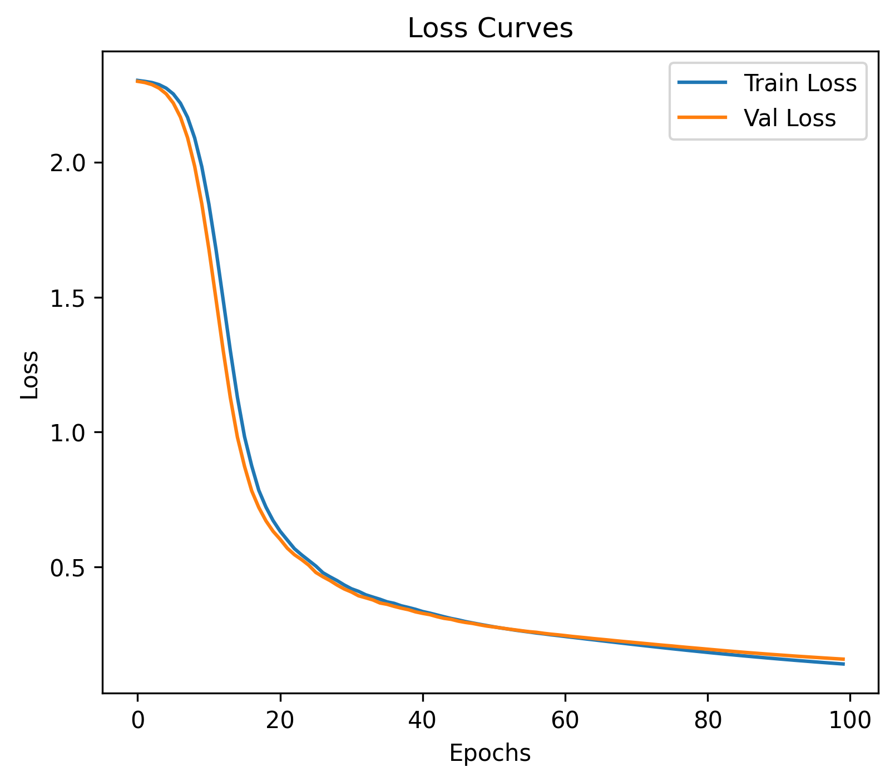
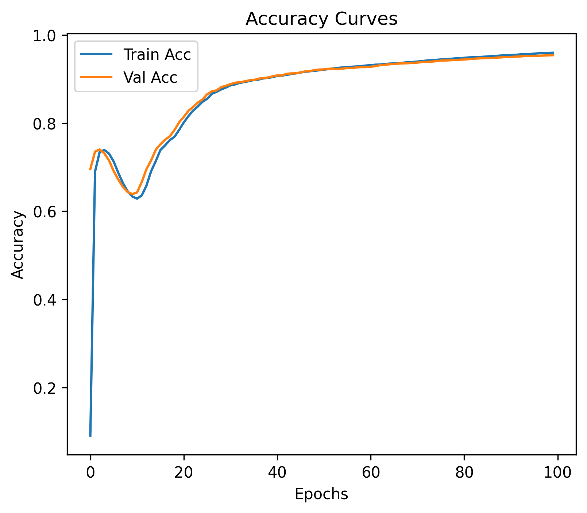
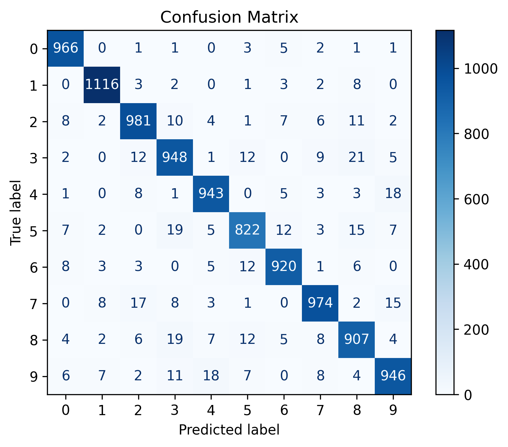

# Neural Networks from Scratch with NumPy

Building this MLP from scratch was a deliberate choice to deepen my understanding of how neural networks truly work. Instead of relying on high-level libraries, I wanted to explore the mathematical foundations and mechanics behind the scenes.

## Why from scratch?
## Handwritten Math Notes
To reinforce my understanding, I manually derived the forward pass and backpropagation equations before coding.  
You can view my scanned notes here: [Forward & Backprop Math (PDF)](forward_backprop_mathByHand.pdf)

- **Mathematical clarity**: Understanding the math behind each layer and operation reveals how data transforms through the network.  
- **Backpropagation**: Implementing backpropagation manually highlights the role of multi-variable derivatives in adjusting weights and biases.  
- **Interconnected variables**: Multi-variable derivatives show how changes in one parameter indirectly influence others, reinforcing intuition about optimization.
- ### Backpropagation: Why the Chain Rule Matters

Backpropagation is the process of sending error signals backward through the network so that each layer can adjust its weights and biases. The key mathematical tool here is the **chain rule of calculus**.

- **Error signals**: The loss function produces an error at the output layer. Backpropagation distributes this error backward, layer by layer, so earlier layers know how much they contributed to the final mistake.  
- **Chain rule**: Each layer’s output depends on the previous layer’s output. The chain rule allows us to compute derivatives of these nested functions efficiently. Without it, we couldn’t connect the error at the output back to the parameters in the first layer.  
- **Deltas (δ)**: In practice, we define a delta term for each layer that represents the error signal scaled by the derivative of the activation function.  
  - For the output layer:  
- For the output layer:  
  δ(L) = ∇a L(a(L), y) · f′(z(L))  
  where a(L) is the activation, y is the true label, and f′(z(L)) is the derivative of the activation.  

- For hidden layers:  
  δ(l) = (W(l+1))ᵀ δ(l+1) · f′(z(l))  

- Weight updates:  
  ∂L/∂W(l) = δ(l) (a(l−1))ᵀ
  This ties the error signal to the inputs of each layer, completing the feedback loop.

### Why this is important
- The chain rule ensures that **every parameter in the network receives a signal** about how it influenced the final output.  
- Deltas make the math modular: each layer only needs its own activation derivative and the error from the next layer.  
- Implementing this manually builds intuition about how optimization works and why gradient-based learning is possible.  

## Goals
- Strengthen my ability to debug and explain neural networks line by line.  
- Bridge theory with practice by translating equations into working code.  
- Build confidence for teaching, interviews, and further research in machine learning.  

## Results
Training the MLP on the MNIST dataset produced clear improvements over time. The charts below summarize the learning process:
- **Loss curves**: Training and validation loss steadily decrease, showing the network is learning meaningful patterns.  
- **Accuracy curves**: Both training and validation accuracy rise toward ~98%, demonstrating strong generalization on unseen data.  
- **Confusion matrix**: Most digits are classified correctly, with only minor confusion between visually similar digits (e.g., 4 vs. 9).

### Visualizations
  
*Training vs. validation loss over epochs.*

  
*Training vs. validation accuracy.*

  
*Performance breakdown across all digit classes.*

## Design Choices: Activation & Loss Functions

### Why ReLU over Sigmoid?
- **Sigmoid limitations**: The sigmoid function squashes values between 0 and 1, which can cause the *vanishing gradient problem*. Gradients become very small for large positive or negative inputs, slowing down learning.  
- **ReLU advantages**: ReLU (Rectified Linear Unit) outputs zero for negative inputs and grows linearly for positive inputs. This helps maintain stronger gradients, speeds up convergence, and works especially well for image datasets like MNIST.  

### Why Softmax + Cross-Entropy instead of MSE?
- **Softmax for classification**: In the output layer, softmax converts raw scores into probabilities across classes (0–9 for MNIST). This not only identifies the most likely class but also provides insight into the relative confidence for other classes.  
- **Cross-Entropy loss**: Cross-entropy directly measures the difference between predicted probability distributions and the true labels. It penalizes incorrect confident predictions more strongly, making training smoother and faster.  
- **Why not MSE?** Mean Squared Error is better suited for regression tasks. In classification, MSE can lead to slower training and less stable gradients because it doesn’t align naturally with probability outputs.  

### Summary
- **ReLU** → mitigates vanishing gradients, faster training.  
- **Softmax + Cross-Entropy** → stable probability outputs, efficient learning for multi-class classification.  
